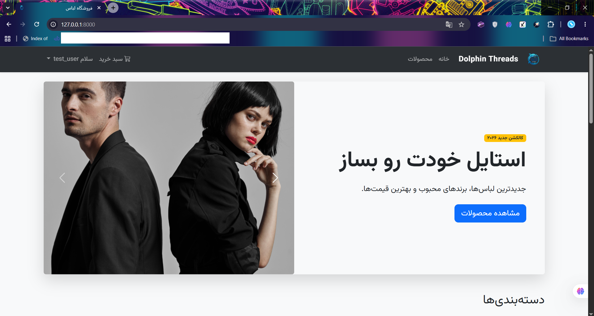
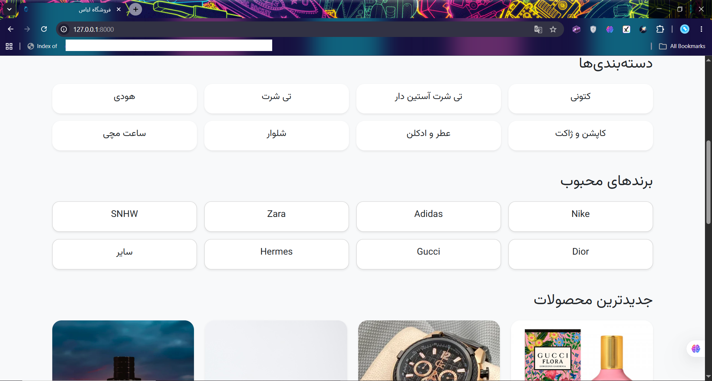
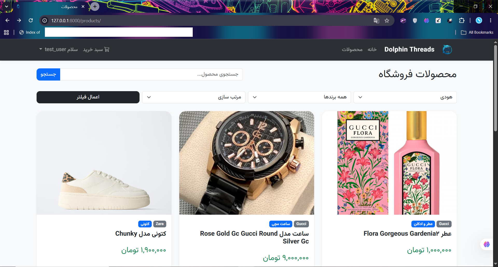
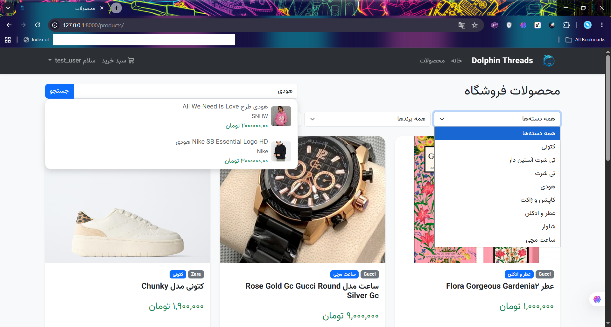
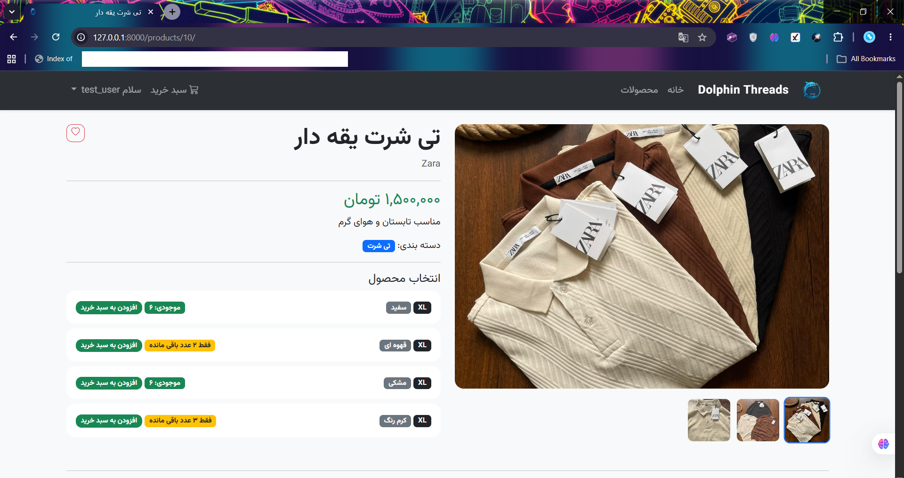
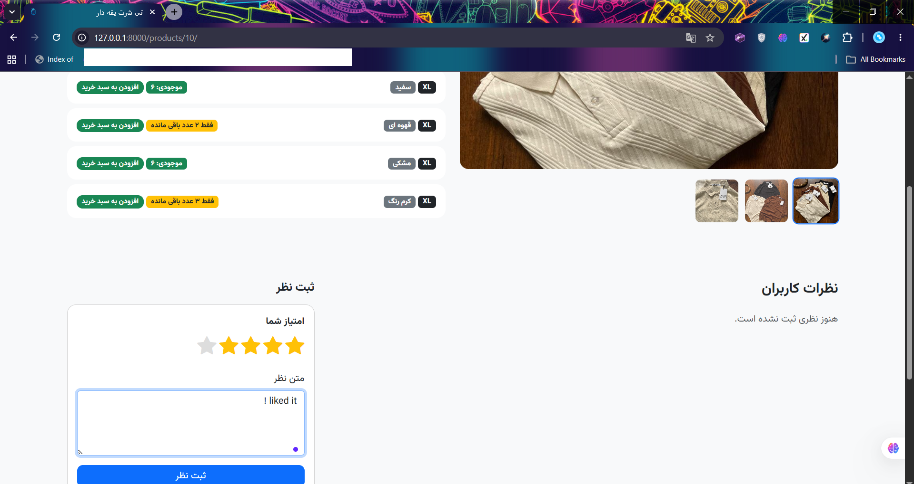
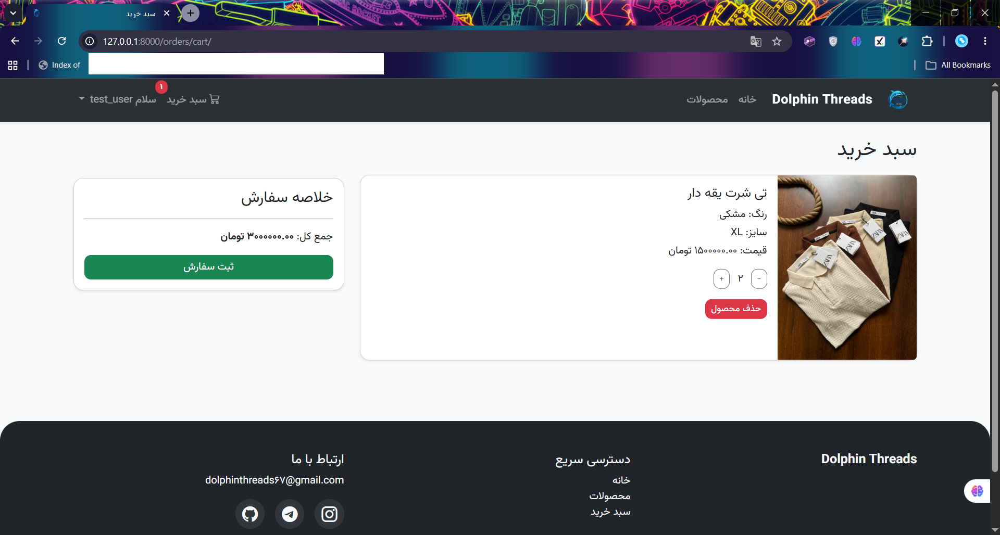
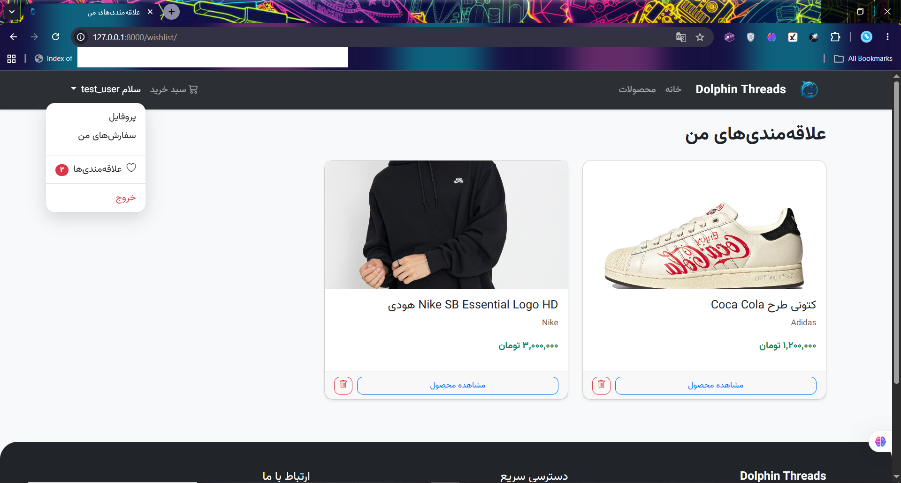
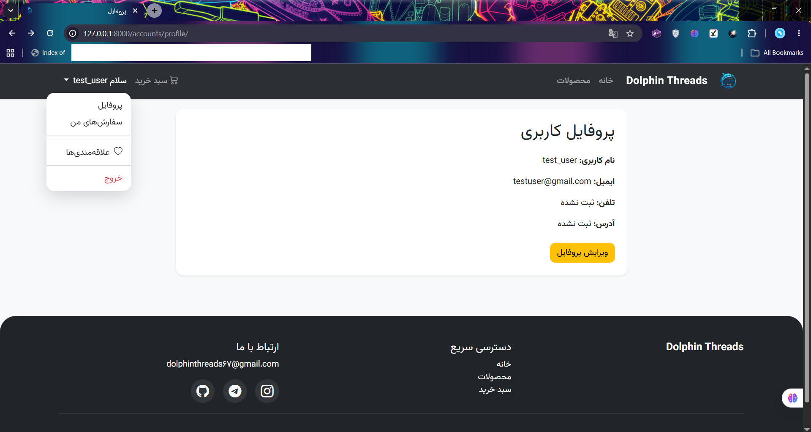
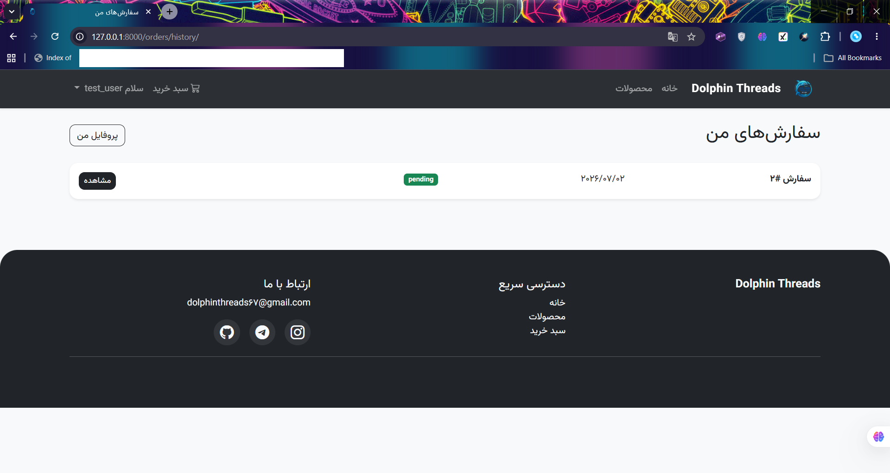

# Dolphin Threads

Persian RTL Clothing Shop built with Django & Django REST Framework.

## Features

### Authentication

* Custom User Model
* Registration System
* Login & Logout
* Email Verification using OTP
* OTP Expiration (5 minutes)
* OTP Resend Functionality
* Maximum Verification Attempts Protection
* Welcome Email System
* User Profiles

### Products

* Categories
* Brands
* Product Variants (Color & Size)
* Product Gallery
* Product Comments & Ratings
* Wishlist System
* Search Products
* Filter Products
* Ordering Products
* Pagination

### Orders

* Shopping Cart
* Cart Management
* Checkout System
* Order History
* Order Detail
* Stock Management

### API

* Django REST Framework
* JWT Authentication
* Swagger / OpenAPI Documentation
* Product API
* Cart API
* Order API
* Account API

### Other

* PostgreSQL Database
* Responsive Design
* Persian RTL UI
* Automated API Tests

---

## Technologies

* Python
* Django
* Django REST Framework
* SimpleJWT
* drf-spectacular
* PostgreSQL
* Bootstrap 5
* JavaScript
* HTML / CSS

---

## Screenshots

### Home Page




### Product List




### Product Detail




### Shopping Cart



### Wishlist



### User Profile



### Order History



### Admin Panel


## API Documentation

Swagger UI:

```text
/api/schema/swagger-ui/
```

OpenAPI Schema:

```text
/api/schema/
```

---

## Installation

Clone repository:

```bash
git clone https://github.com/RealRick37/Dolphin-Threads.git
```

Install dependencies:

```bash
pip install -r requirements.txt
```

Create `.env` file:

```env
SECRET_KEY=your_secret_key

DB_NAME=your_db_name
DB_USER=your_db_user
DB_PASSWORD=your_db_password
DB_HOST=localhost
DB_PORT=5432

EMAIL_HOST_USER=your_email
EMAIL_HOST_PASSWORD=your_app_password
```

Run migrations:

```bash
python manage.py migrate
```

Create superuser:

```bash
python manage.py createsuperuser
```

Run development server:

```bash
python manage.py runserver
```

---

## Tests

Run all tests:

```bash
python manage.py test
```

---

## Current Version

v3.0

---


## Future Plans

Not really sure what else could be added.

---


## Language

This project is designed for Persian-speaking users and uses a fully RTL interface.

## More

This project started as a simple learning project and gradually evolved into a complete e-commerce platform with both web and REST API support.
And all along, it was such a great experience for me...

Hope you find it useful :)
